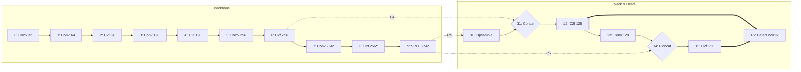

# Trash-can-Can

安徽省工创赛垃圾分类赛道,视觉和电控部分代码，支持在PC和树莓派平台上运行。

## 特点

- 支持YOLO和自定义模型进行实时垃圾分类
- PC和树莓派均可使用
- Arduino集成，用于硬件控制
- 视频录制功能

## 使用

```bash
# PC
python detect_pc.py [--model models/trashcan.pt] [--source 0]

# 树莓派
python detect_pi.py [--model models/trashcan.pt] [--source 0]

#录制检测结果
python detect_record.py [--output output.mp4]
```


## 模型

| 模型名称 | 尺寸 | 参数量 | 算力需求 | mAP50-95 |
| :--- | :--- | :--- | :--- | :--- |
| [tiny.pt](https://drive.google.com/file/d/1BM-SHi3LWB1sTll8nD_bHnq3ldCWuK_R/view?usp=drive_link) | 320x320 | 373,736 | **1.0 GFLOPs** | 0.856 |
| [yolo11n.pt](https://drive.google.com/file/d/1DHkkDy785-Q7F33fOIVkW5Zu2sVgemKo/view?usp=drive_link) | 320x320 | 2,584,492 | 6.3 GFLOPs | 0.946 |
| [yolo26s.pt](https://drive.google.com/file/d/136D3ziKoXGuKk8RMVUXP154-t96Zqwmo/view?usp=sharing) | 640x640 | 9,469,824 | 20.5 GFLOPs | **0.954** |



> 自定义的轻量模型结构，因为场景固定所以削减了多尺度、小尺度的参数量，三个模型做基本工作都管够，摄像头拍到手或者缝隙时，被干扰较小可以放心用（因为数据里见过了）

## 数据集

详见[Kaggle](https://www.kaggle.com/datasets/codingbearhsun/trash-sort)


## 电控方案


因为比赛超过高度所以后来把机械爪拆掉了...

## 文件结构

```
.
├── detect_pc.py      # PC端检测脚本
├── detect_pi.py      # 树莓派检测脚本
├── detect_record.py  # 视频录制脚本
├── models/           # 预训练模型
├── images/           # 测试图像
│   ├── origin_img/   # 原始图像
│   ├── json_labels/  # Labelme JSON标签
│   └── yolo_labels/  # YOLO格式标签
├── datasets/         # 训练数据集
│   ├── train/        # 训练集
│   └── valid/        # 验证集
└── process_data/     # 处理自定义数据的工具
    └── box/          # 边界框转换工具
```

## 数据处理

我准备了一套数据处理管道:

1. **准备原始图像**
   - 将原始图像放入 `images/origin_img/`

2. **标注图像**
   - 使用 Labelme 或 Label-studio 进行标注
   - 从 `images/origin_img/` 打开图像
   - 保存 JSON 标注文件

3. **清理未标注图像**
   ```bash
   python clear_not_labeled_img.py
   ```
   该命令会删除未标注图像对应的 JSON 文件

4. **整理标签文件**
   - 将所有 JSON 标签文件移动到 `images/json_labels/`

5. **转换为 YOLO 格式**
   ```bash
   python process_data/box/labelme2yolo.py
   ```
   这会将 JSON 标签转换为 YOLO 格式，并保存到 `images/yolo_labels/`

6. **准备训练数据**
   - 将 `images/origin_img/` 和 `images/yolo_labels/` 中的所有文件复制到 `datasets/train/`

7. **划分数据集**
8. **数据增强**
   - 建议在训练时划分和增强, yolo默认的增强即可

9. **打包用于训练**
   - 确保 `mydata_kaggle.yaml` 配置正确
   - 使用 Bandizip 压缩数据集 (win11自带的会多一层目录, 导致混乱)
   - 上传到 Kaggle 进行训练

## 问题

我遇到这些问题:
- 模型在不同光照条件下的鲁棒性不足。
- 把碎瓷片和白萝卜条区分开

## License

本项目基于 Apache License 2.0 许可 - 详情请见 [LICENSE](LICENSE) 文件。

## 致谢

- [Ultralytics](https://github.com/ultralytics/ultralytics) 提供 YOLO
- [Kaggle](https://www.kaggle.com) 提供 GPU 资源
- 特别感谢我的队友...

